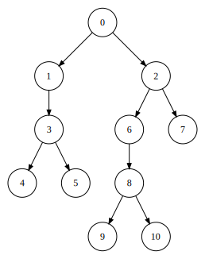

# Drag

Drag is a graph drawing library for creating nice looking layouts of directed graphs. I originally implemented this library for my [bachelor's thesis](https://is.muni.cz/th/kmkvd/?lang=en). Since then, the API has changed but the algorithms are still the same.

## What exactly does it do?

In a nutshell, you provide a directed graph and the library produces a nice looking layout of that graph in 2D space. That means, it computes the positions of all vertices in the graph and the points through which the edges (which, for simplicity, are represented as polylines) should be routed such that there are as few edge crossings as possible.

It is important to note that this is the main purpose of the library. It computes a layout. It is not meant for converting this layout into an image or styling this image. It is meant as a backend for such applications.

Nevertheless, it contains a simple drawing api for creating quick and dirty svg images of the produced layouts. However, it is very limited in what it can do. There is also an example command-line application which uses this api. If you want to know more read this [section](#producing-svg-images).

## Can I see some of those layouts please? 

Sure thing.

## What graphs is it suitable for?

The short answer is *directed* *acyclic* graphs. They can be *disconnected* in which case the input graph is split into connected components which are layed out separately and put next to each other in the final layout.

This is due to the type of layout the library uses - it creates layered layout. That means the vertices are placed on horizontal lines and all edges are pointed downwards. Here you can see an example of this in action. The following image was produced

This emphasizes the direction and flow of the graph and is most suitable for graphs representing some sort of hierarchy or ordering - i.e. *directed* *acyclic* graphs.

Such a layout makes it easy to see that some vertices are in some sense *superior* to others just by looking if they are above or below. It also makes it easier to trace paths for a vertex since these will always go downwards.

Nevertheless, the requirement for the graph to be *acyclic* is not strict. The library can cope with cycles but the produced images might not be ideal since this kind of layout is not suitable for cycles - some edges must point upwards and this defeats the purpose of the layout.

Short answer: directed ideally acyclic graphs but directed graphs with only few cycles are also fine.

It should be used only for *directed* graphs. In theory one could use it to make a layout of an undirected graph by giving each edge an arbitrary direction. However, the resulting layout wouldn't make much sense and wouldn't convey the information contained in the graph very well. 

## Producing SVG images

TODO
