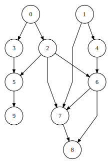

# Drag

Drag is a graph drawing library for creating nice looking layouts of directed graphs. I originally implemented this library for my [bachelor's thesis](https://is.muni.cz/th/kmkvd/?lang=en). Since then, the API has changed but the underlying algorithms are still the same.

## What exactly does it do?

In a nutshell, you provide a directed graph and the library produces a nice looking layout of that graph in 2D space. That means, it computes the positions of all vertices in the graph and the points through which the edges (which, for simplicity, are represented as polylines) should be routed such that there are as few edge crossings as possible.

It is important to note that this is the main purpose of the library. It computes a layout. It is not meant for converting this layout into an image or styling this image. It is meant as a backend for such applications.

Nevertheless, it contains a simple drawing api for creating quick and dirty svg images of the produced layouts but it is very limited in what it can do. If you want to know more about that read this [section](#producing-svg-images).

## Can I see some examples please? 

Sure thing. Check them out.




## What graphs is it suitable for?

The short answer is *directed* *acyclic* graphs. They can be *disconnected* in which case each connected component is layed out separately.

These requirements come from the fact that the library produces layered layouts. That means the vertices are placed on horizontal lines and all edges are pointed downwards. You can see exactly that in the images above. 

This layout is most suitable for graphs representing some sort of hierarchy or ordering - i.e. *directed* *acyclic* graphs. Such a layout makes it easy to see that some vertices are in some sense *superior* to others just by looking if they are above or below. It also makes it easier to trace paths from a vertex since these will always go downwards.

Nevertheless, the requirement for the graph to be *acyclic* is not strict. The library can cope with cycles but the produced images might not be ideal since this kind of layout is not suitable for cycles - some edges must point upwards and this defeats the purpose of the layout. For small number of cycles it can be fine but the more cycles the worse it gets.

## How to use the library in your project

The library is header-only so using it is very simple, the only requirement is a compiler supporting `c++17`. There are couple of options how to include the library in your project.

One way is to just grab the `drag` subdirectory from the `include` directory and place it in your project. Then you can happily include the headers that you need. The two most important ones are `drag/drag.hpp` which includes everything necessary to create a layout and `drag/drawing/draw.hpp` which contains the svg drawing interface.

The second option is to use `cmake`. To do that, grab the whole repository and place it inside your project. Then in your `CMakeLists.txt` you can add the library as a subdirectory and link to it like so:

```CMake
add_subdirectory(drag)

add_executable(your-target your-source.cpp)
target_link_libraries(your-target drag)
```

This will ensure that `your-target` has the proper include directories set and is compiled with `c++17`.

## Compiling the examples

You can read more about that [here](example/README.md).

## Getting started

A simple complete and working example for creating and visualizing a layout of a graph might look something like this.

```C++
#include <drag/drag.hpp>
#include <drag/drawing/draw.hpp>

int main() {
    drag::graph g;

    auto a = g.add_node();
    auto b = g.add_node();
    auto c = g.add_node();

    g.add_edge(a, b);
    g.add_edge(a, c);

    drag::sugiyama_layout layout(g);

    auto image = drag::draw_svg_image(layout, drag::drawing_options{});
    image.save("image.svg");
}
```

A more detailed description follows in the next sections.

### Creating the input graph

First thing to do is to convert whatever you are trying to draw as a graph (be it your own graph representation or some data) into the graph representation of the library, i.e. you need to create an instance of `graph`. This can be done by creating nodes and adding edges between them.

```C++
drag::graph g;

auto u = g.add_node();
auto v = g.add_node();

g.add_edge(u, v);
```

Concrete example of constructing a graph is for example the implementation of `graph_builder` in `graph.hpp`.

Besides the structure of the graph the library also needs to know the desired parameters of the layout. An important thing to note is that the library assumes all nodes are circles of the same radius. So if you want to place some content inside of the nodes, their size should be set such that the content will fit.

The layout parameters include
 * `node_size` - radius of all nodes
 * `node_dist` - minimal distance between the borders of two nodes on the same layer
 * `layer_dist` - minimal distance between the borders of nodes on two neighboring layers 
 * `loop_angle` - the angle from the x-axis at which loops connect to nodes
 * `loop_size` - how far the loops extend from nodes

You can either set them yourself or just don't do anything and use the default values.

```C++
g.node_size = 15;
g.layer_dist = 20;
// ...
```

### Creating and using the layout

To create a layout simply create an instance of `sugiyama_layout`. The whole computation of the layout is done in the constructor.

```C++
drag::sygiyama_layout layout(g);
```

The resulting layout can then be accessed through the interface of `sugiyama_layout`. General usage pattern might look something like this.

```C++
for (auto node : layout.vertices()) {
    // use the information in `node` to draw it
}

for (auto edge : layout.edges()) {
    // draw the edge
}
```

`layout.vertices()` returns a vector of nodes. The `node` structure looks as follows.

```C++
struct node {
    vertex_t u;  // the corresponding vertex identifier
    vec2 pos;    // the position in space
    float size;  // the radius
};
```

Similarly `layout.edges()` returns a vector of the edges represented using the `path` structure.

```C++
struct path {
    vertex_t from, to;           // the vertex identifiers of endpoints of the corresponding edge
    std::vector< vec2 > points;  // control points of the poly-line representing the edge
    bool bidirectional;          // is the edge bidirectional?
};
```

The first and last point of the paths are computed such they lie on the border of the corresponding nodes.

A concrete example of using the layout can be seen in the implementation of the svg api in `draw.hpp`.

## Producing SVG images

This section describes the interface for creating svg images. There is also an example command-line application which can be used for turning graphs into svg images which you can find in the `example/draw` folder.

```C++
#include <drag/drag.hpp>
#include <drag/drawing/draw.hpp>

int main() {
    drag::graph g;

    auto a = g.add_node();
    auto b = g.add_node();
    auto c = g.add_node();

    g.add_edge(a, b);
    g.add_edge(a, c);

    drag::drawing_options opts;

    opts.labels[a] = "a";
    opts.labels[b] = "b";
    opts.labels[c] = "c";

    opts.colors[a] = "blue";
    opts.colors[b] = "green";

    opts.edge_colors[{a, b}] = "red";

    auto image = drag::draw_svg_image(g, opts);
    image.save("image.svg");
}
```

This a short example of how to use the drawing interface. It produces the following graph.


Images are produced using the function `draw_svg_image`. It can be used to draw both graphs and layouts. The styling of the image is done through `drawing_options`. It enables you to customize the following:
 
 * **node labels** - These can be set through `drawing_options::labels` and are displayed inside the nodes. If no label for a node is specified its id will be used - i.e. a number from `0` to `n - 1` where `n` is the number of nodes. You can disable the labels completely by setting `drawing_options::use_labels` to `false`. 
 
 * **node colors** - These can be set using `drawing_options::colors`. The default color is black. The color is given as a string containing anything that might pass as a color specifier in svg. Among other things that includes a name of a color (as in the code snippet) or rgb code such as `"rgb(0, 0, 255)"` or in the hexadecimal form as `"#0000ff"`.
 * **edge colors** - Can be set using `drawing_options::edge_colors` and work the same way as node colors.
 * **font size** - Is set using `drawing_options::font_size` and determines the size of labels.
 * **margin** - Can be set using `drawing_options::margin` and determines the amount of space around the graph.
